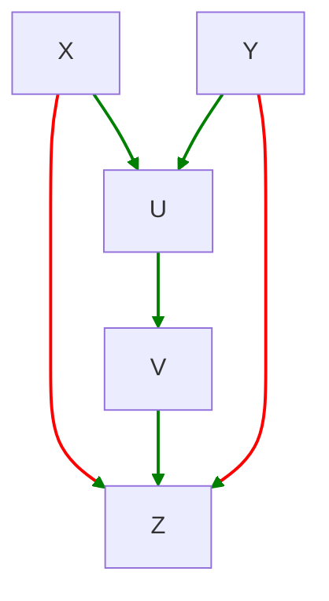

# Tema-2-PA
Tema 2 Proiectarea Algoritmilor (2024)
## Problema 1 - NUMARARE

Codul implementează o abordare dinamică programată pentru a calcula numărul de lanțuri elementare comune. Am utilizat sortarea topologică pentru a determina ordinea de procesare a nodurilor și se stochează rezultatele intermediare pentru a evita recalcularea.

> Pentru a determina ordinea optimă de procesare a nodurilor în ambele grafuri, se aplică algoritmul de sortare topologică fiecărui graf (am folosit algoritmul lui Kahn). Această sortare asigură că un nod va fi analizat doar după ce toți vecinii săi au fost deja procesați, permițând o abordare corectă a calculului lanțurilor elementare comune.

> Se definește un vector dp pentru a stoca numărul de lanțuri elementare comune care se termină la fiecare nod din primul graf. Se inițializează dp cu 0 pentru a reflecta lipsa lanțurilor elementare comune la început.

> Apoi, se parcurge vectorul de noduri sortat al primului graf. Pentru fiecare nod curent, se analizează vecinii săi din primul graf. Se verifică dacă muchia corespunzătoare există și în al doilea graf. Dacă da, se adaugă la `dp[nod_curent]` suma lanțurilor elementare comune obținute din vecinii procesați anterior. Această sumă reprezintă numărul de modalități de a ajunge la nodul curent prin lanțuri elementare comune, ținând cont de opțiunile disponibile din vecinii săi.

> Valoarea `dp[nod_destinație]` stochează numărul total de lanțuri elementare comune care se termină la nodul destinație din primul graf. Acest rezultat final reprezintă numărul de trasee comune de antrenament pe care le poate identifica Adrian pentru a-și rememora studenția. Se afișează acest rezultat final în fișierul de ieșire, oferindu-i lui Adrian o perspectivă asupra similarităților dintre traseele de antrenament și drumurile din București.

### Complexitate:

Atât sortarea topologică, cât și calculul lanțurilor elementare comune au o complexitate temporală de  <span style="color:PaleVioletRed">**O(V + E)**</span>, făcând codul eficient pentru grafuri mari.

### Mentiuni:
> * atat la problema 1, cat si la Problema 2, algoritmul de TopSort a fost implementat dupa pasii din laborator. Aici am folosit o sortare topologica pe baza de DFS, in timp ce la Problema 2 am ales sa implementez algoritmul lui Kahn.

## Problema 2 - TRENURI

Ce se urmareste de fapt prin aceasta problema este calculul drumului de lungime maxima de un nod sursa la un nod destinatie (fiindca ne dorim sa trecem prin cat mai multe orase).

Am inceput prin a asocia fiecarui oras un index, pentru a lucra mai usor cu acestea.

Ulterior, am organizat orașele in ordine topologica. Acest lucru este crucial pentru a calcula corect distanța maximă între orașe, deoarece dorim să evităm să revenim înapoi pe rutele pe care le-am parcurs deja. De exemplu, dacă avem orașele A, B și C si există o rută de la A la B și una de la B la C, atunci sortarea topologică ne va garanta că A va fi înaintea lui B și B va fi înaintea lui C.

După ce avem această ordine, putem calcula distanța maximă de la orașul de plecare la toate celelalte orașe. Navigam prin orașe, folosind informațiile din sortarea topologică. Astfel, ne asigurăm că nu ne îndreptăm către orașe care nu au fost încă explorate și că ajungem la destinație folosind drumul cel mai lung posibil. A se vedea functia longest_path:

```
// facem sortarea topologica si o retinem in Stack
    stack<int> Stack = topologicalSort(graph);
    vector<int> dist(graph.V, -1);
    dist[s] = 1;

    while (!Stack.empty()) {
        int u = Stack.top();
        Stack.pop();

        if (dist[u] != -1) {
            for (const auto& neighbor : graph.adj[u]) {
                int v = neighbor;
                // daca "cea mai lunga cale" (distanta)
                // catre un oras conectat este mai mica
                // decat distanta actuala a orasului + 1
                // (adica conexiunea adauga un alt hop),
                // distanta orasului conectat este actualizata
                if (dist[v] < dist[u] + 1) {
                    dist[v] = dist[u] + 1;
                }
            }
        }
    }
```


### Complexitate:

La fel ca la problema 2, avem o complexitate temporala de  <span style="color:PaleVioletRed">**O(V + E)**</span>.

### Mentiuni:
> * flow-ul progamului a fost inspirat de aici:
https://www.geeksforgeeks.org/find-longest-path-directed-acyclic-graph/

## Problema 3 - DRUMURI

Ne dorim sa alegem o submultime de muchii cu suma costurilor minima, formata de fapt din muchiile necesare pentru drumurile X -> Z, respectiv Y -> Z. Problema ne duce cu gandul la un algoritm de tip Dijkstra, fiind vorba de drumuri minime.

Insa avand in vedere faptul ca nu putem pur si simplu sa adunam costurile minime pentru cele doua drumuri (fiindca pot exista muchii comune, iar drumurile alese pentru a forma sumbultimea de muchii pot varia), solutia cea mai la indemana a fost sa parcurg pe rand fiecare muchie, si daca drumurile care trec prin aceasta sunt mai convenabile ca si cost al submultimii, vom actualiza datele.

> Pentru a realiza implementarea ideii, m-am folosit de 3 apeluri ale functiei Dijkstra de a calcula costurile minime de la un nod sursa la toate celelalte. De ce 3? Pentru cele 3 "bucati" ale drumului prin muchia curenta:
>    - drum X -> U
> - drum Y -> U
> - drum V -> Z (aici vom avea nevoie de un Dijkstra pe graful inversat, pentru a face drumul minim de la orice nod la Z)

**Oare nu cumva drumurile prin muchia U -> V au cost total mai mic?**


### Complexitate:

Complexitatea totală a programului este dominată de algoritmii Dijkstra (care utilizeaza priority queue) care se execută de trei ori, adică <span style="color:PaleVioletRed">**O(3(V + E)log V)**</span>, simplificând la <span style="color:PaleVioletRed">**O((V + E)log V)**</span>, plus complexitatea pentru minEdgeSum care este <span style="color:PaleVioletRed">**O(V*E)**</span>.

### Mentiuni:

- dupa cum am mentionat, am folosit un algoritm Dijkstra cu priority queue, pentru a fi cat mai eficient din punct de vedere temporal
- am urmarit pasii pentru Dijkstra de aici: https://www.geeksforgeeks.org/dijkstras-shortest-path-algorithm-using-priority_queue-stl/

## Problema 3 - SCANDAL

Implementarea programului a avut la baza algoritmul lui Kosaraju pentru a separa componetele tari conexe ale grafului. Pentru a organiza relatiile dintre persoane in graf, am folosit o abordare 2-SAT.

Cum am transformat?

| Relatie (c)      | Interpretare |
| ----------- | ----------- |
| 0      | cel putin unul participa **<br> ¬x → y <br> ¬y → x** |
| 1      | daca nu participa x, nu participa nici y **<br> ¬x → ¬y <br> y → x** |
| 2      | daca nu participa y, nu participa nici x **<br> ¬y → ¬x <br> x → y** |
| 3      | cel putin unul NU participa **<br> x → ¬y <br> y → ¬x** |

Astfel, construiesc graful orientat pe bza regulilor de mai sus, luand in calcul faptul ca negarea unui nod `x `este un nod independent, `¬x`.

Verificarea satisifiabilitatii si gasirea unei solutii are la baza algoritmul lui Kosaraju pentru gasirea componentelor tari conexe ale grafului tocmai construit.

> Formula 2-SAT este **satisfiabila** <=> x si ¬x se afla in componente tari conexe diferite, oricare ar fi persoana x.

Prin aplicarea Kosaraju, componentele tari conexe sunt deja topologic, deci nu mai este nevoie sa aplicam TopSort. Daca as fi folosit Tarjan, coponentele ar fi rezultat in ordine invers topologica, asa ca am preferat Kosaraju in contextul de fata :)).

## Complexitate:

Functiile de DFS folosite pentru Kosaraju au complexitatea <span style="color:PaleVioletRed">**O(N + M)**</span>, iar Kosaraju are in total <span style="color:PaleVioletRed">**O(2(N + M) + V)**</span>, marcand de fapt complexitatea intregului program.

## Mentiuni

- inainte de a scrie programul, am analizat aceste doua surse pentru a intelege mai bine teoria despre 2-SAT:
  - https://en.wikipedia.org/wiki/2-satisfiability
  - https://cp-algorithms.com/graph/2SAT.html 
